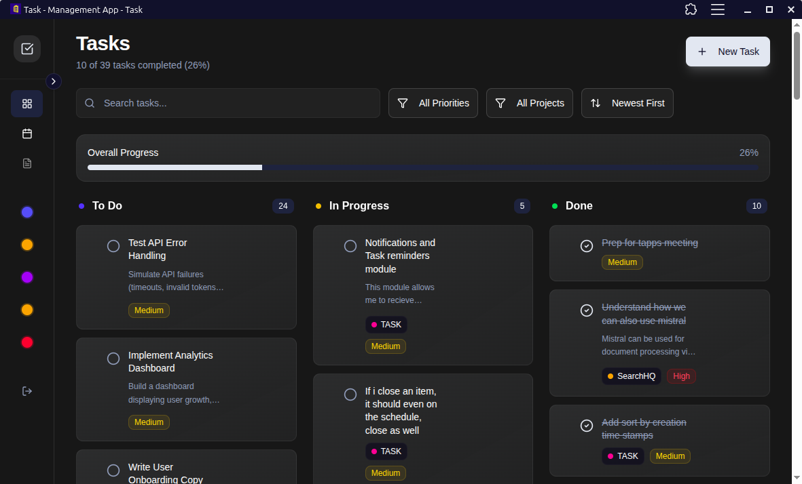

## Task

A modern task and project management application built with Convex. This application provides comprehensive task tracking, intelligent notifications, analytics, and project management capabilities.

<p align="start">
  
</p>

## Overview

Task is a full-featured project management system designed to help individuals and teams track their work efficiently. The application uses a serverless backend (Convex) for real-time data synchronization and provides a progressive web app experience.

## Core Features

### Task Management

- **Kanban Board**: Visual task organization with four columns (To Do, In Progress, Review, Done) with drag-and-drop
- **Priority Levels**: classification and Task Types: Categorize tasks as Bug, Feature, or General
- **Project Association**: Link tasks to specific projects for organization
- **Quick Actions**: Inline editing, scheduling, and status updates

### Smart Notification System

The application includes an intelligent threshold-based notification system that monitors task age:

- **Default Thresholds**:
  - High priority tasks: 1 day
  - Medium priority tasks: 3 days
  - Low priority tasks: 7 days

- **Automatic Monitoring**: A background cron job runs every minute to check all open tasks
- **Two-Tier Alerts**:
  - "At Risk" notifications when tasks reach 80% of threshold
  - "Overdue" notifications when tasks exceed threshold
- **Visual Indicators**: Task cards display colored borders and badges to highlight overdue or at-risk status

### Daily Schedule

- **Time-Based Planning**: Schedule tasks for specific dates with optional time slots
- **Calendar View**: Navigate between dates to plan work ahead
- **Completion Tracking**: Mark scheduled tasks as complete independently from main task status
- **Task Selection**: Choose from existing tasks or create new ones for scheduling

### Analytics and Statistics

Comprehensive statistics page providing insights into productivity:

- **Overview Metrics**:
  - Total tasks and completion rates
  - Average time to complete tasks
  - Weekly and monthly task creation trends
  - Current active tasks by status

- **Distribution Analysis**:
  - Pie charts showing task breakdown by status, priority, and type
  - Visual representation of workload composition

- **Completion Time Stats**:
  - Bar charts displaying average completion time by priority level
  - Timeline data for the last 30 days

- **Productivity Trends**:
  - Area charts comparing task creation vs completion over time
  - Identify productivity patterns and bottlenecks

- **Project Performance**:
  - Per-project analytics with completion rates
  - Overdue task counts to identify problem areas

- **Overdue Task Alerts**:
  - Highlighted section showing all tasks exceeding thresholds
  - Direct links to tasks requiring attention

<p align="start">
  
</p>

### Meeting Notes

- **Note Taking**: Create and manage meeting notes with date association
- **Rich Content**: Full markdown-style text editing for detailed notes
- **Tag System**: Organize notes with custom tags for easy retrieval
- **Search and Filter**: Quickly find notes by content or date

### Command Palette

Quick keyboard-driven navigation and actions:

- `Cmd/Ctrl + K`: Open command palette
- `Cmd/Ctrl + N`: Create new task
- `Cmd/Ctrl + P`: Create new project
- `Cmd/Ctrl + S`: Schedule task
- `Cmd/Ctrl + M`: Create meeting note
- `Cmd/Ctrl + 1-4`: Navigate between views (Tasks, Daily, Stats, Notes)

## Installation

1. Clone the repository:

```bash
git clone https://github.com/ThembinkosiThemba/tasks.git
cd tasks
```

2. Install dependencies:

```bash
npm install --legacy-peer-deps
```

3. Set up Convex and server:

This will guide you through creating a Convex project and setting up authentication.

```bash
npm run dev
```

The app will open automatically at http://localhost:5173

## Building for Production

Build the application:

```bash
npm run build
```

Preview the production build:

```bash
npm run preview
```

## PWA Installation

This app is a Progressive Web App (PWA) and can be installed on your device:

### Desktop (Chrome, Edge, Brave)

1. Visit the deployed web URL
2. Look for the install icon in the address bar (usually a plus sign or computer icon)
3. Click "Install" to add the app to your desktop

Once installed, the app works on device and provides a native app-like experience with auto-updates enabled.

Make sure to configure your Convex deployment URL in the production environment variables.
